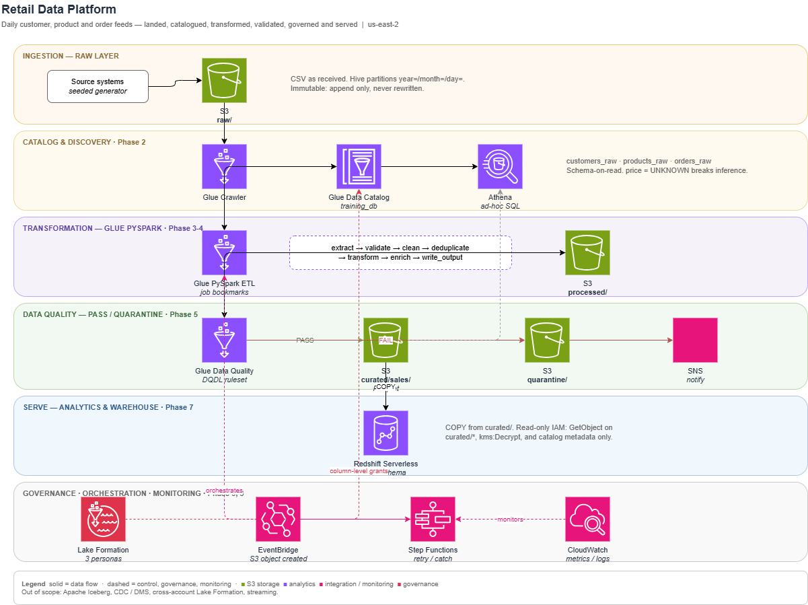

# AWS Retail Data Pipeline

A production-style data engineering platform on AWS, built on a synthetic
retail dataset: S3 medallion lake, Glue Crawlers and PySpark ETL, Glue Data
Quality with quarantine, Athena, Lake Formation governance, a Redshift
Serverless star schema, and EventBridge/Step Functions orchestration.

Everything is Terraform-managed and **destroyed at the end of every working
session**. That constraint is not housekeeping, it is the design driver: it
forces every resource into version control, makes the whole platform
rebuildable from an empty account with two commands, and keeps the running cost
near zero between sessions.



---

## Conventions

| | |
| --- | --- |
| Region | `us-east-2`, pinned in [`config/project.env`](config/project.env) and nowhere else |
| Resource names | `de-training-*` and `training_db`, exactly as the brief specifies. Account id suffixed only where AWS requires global uniqueness (S3) |
| Tags / labels | `Project=retail-data-pipeline` - the domain identity, not the exercise |
| Catalog | `training_db`, with `customers_raw` / `products_raw` / `orders_raw` (brief, p.6-7) |
| Tags | `Project`, `Layer`, `Phase`, `ManagedBy` on every resource |
| Glue | 5.0 (Spark 3.5 / Python 3.11) |
| IaC | Terraform 1.10+, AWS provider 6.x |
| State | S3 backend with native `use_lockfile` locking, no DynamoDB table |

The region deliberately matches the AWS CLI default. A mismatch between
Terraform's region and the CLI's would make every ad-hoc `aws` command silently
target the wrong place.

---

## Layout

```
config/            project.env (single source of truth), pipeline config
src/
  generate/        seeded synthetic dataset + deliberate-defect injector
  extract/         source readers
  transform/       Glue PySpark ETL modules
  quality/         DQDL rulesets and quarantine logic
  common/          shared helpers, logging, config loading
sql/               athena/ and redshift/ DDL and analytical queries
tests/             pytest, runs without any AWS access
infrastructure/
  persistent/      NEVER destroyed: KMS, IAM, lake bucket, budgets
  training/        destroyed every session: Glue, Athena, Redshift, SFN
scripts/           de.sh dispatcher + teardown verification
architecture/      retail-data-platform.drawio + architecture-diagram.png
docs/              capstone, decisions, reference repos, learnings,
                   cost log, evidence packs
```

---

## The two-layer split

The single most important design decision in the repo.

| Layer | Holds | Lifecycle | Cost when idle |
| --- | --- | --- | --- |
| `persistent/` | KMS CMK, IAM roles, lake bucket, budgets | created once | ~$1.50/month |
| `training/` | Glue jobs/crawlers/catalog, Athena workgroup, Redshift, Step Functions, EventBridge, CloudWatch | destroyed every session | $0 |

Splitting by **lifecycle** rather than by service is what makes a routine
`terraform destroy` safe. A single state file would force a choice between
destroying the KMS key that decrypts yesterday's data, or protecting so much
that the teardown stops being meaningful.

Three related choices fall out of it:

- **The state bucket is created by `bootstrap`, not by Terraform.** Terraform
  cannot cleanly own the bucket its own state lives in. One idempotent CLI call
  avoids the local-state-then-migrate dance entirely.
- **No NAT Gateway, anywhere.** Nothing in scope needs Glue inside a VPC: Glue
  reaches S3, the Catalog and Redshift over AWS-managed networking. A NAT
  Gateway would add ~$33/month for no capability. `de.sh verify` treats the
  existence of one as a hard failure.
- **A daily budget, not just a monthly one.** A monthly ceiling is too slow to
  catch the failure that actually matters here: a session ending with the
  training layer still standing.

Full reasoning, with alternatives and trade-offs, in
[`docs/decisions.md`](docs/decisions.md).

---

## The session loop

```bash
./scripts/de.sh up 03            # 1. create the ephemeral layer
#    ... phase work ...
./scripts/de.sh evidence 03      # 2. capture proof to docs/evidence/phase-03/
git commit -am "phase 3: ..."    # 3. commit
./scripts/de.sh down             # 4. destroy the ephemeral layer
./scripts/de.sh verify 03        # 5. prove nothing survived
```

Step 5 exits non-zero if anything billable is still standing. A session is not
finished until it is green. `terraform destroy` is a claim;
[`verify_teardown.sh`](scripts/verify_teardown.sh) is the proof: it asserts by
live API call across Glue, Step Functions, EventBridge, Kinesis, Redshift,
Lambda, SNS, CloudWatch, Athena and EC2, sweeps three other regions for strays,
and appends the day's spend to [`docs/cost-log.md`](docs/cost-log.md).

---

## Getting started

```bash
# 1. Dependencies
py -3 -m pip install -r requirements-dev.txt

# 2. Set the budget alert address (bootstrap refuses to run without it)
cd infrastructure/persistent && cp terraform.tfvars.example terraform.tfvars && cd -
#    then set a real address in budget_notification_email
#    *.tfvars is gitignored, so personal values never reach the repo

# 3. One-time: state bucket, KMS, IAM, lake bucket, budgets
./scripts/de.sh bootstrap

# 4. Generate the dataset and load the raw layer
./scripts/de.sh gen
./scripts/de.sh up 00
./scripts/de.sh load csv

# 5. Tear it back down
./scripts/de.sh down && ./scripts/de.sh verify
```

Run `./scripts/de.sh help` for the full command list. Always drive Terraform
through `de.sh`, or `source config/project.env` first: a bare `terraform init`
misses the shared provider cache and drops another ~860 MB into `.terraform/`.

---

## Dataset

Synthetic retail, generated locally from a fixed seed so the raw layer is
reproducible byte-for-byte after any teardown. No public dataset is used, per
the brief.

| Table | Columns | Dev default | Training scale |
| --- | --- | ---: | ---: |
| `customers` | customer_id, customer_name, email, country, created_date | 1,000 | 100,000 |
| `products` | product_id, product_name, category, price | 200 | 5,000 |
| `orders` | order_id, customer_id, product_id, quantity, order_date, status | 10,000 | 1,000,000 |

Defaults are the development sizes: correctness is proved on a small
deterministic dataset first. The training-scale figures from the brief are
passed explicitly when the Spark scaling exercise is reached, so the safe size
is the one you get by accident.

Clean data is written to `data/raw/`; deliberately broken copies go to
`data/test_fixtures/`. The two are never mixed.

Emitted as CSV, JSON and Parquet of identical data, since the format comparison
in Phase 1 needs all three. Orders spread across ~30 daily partitions so
incremental processing has real multi-day history to work with.

[`src/generate/inject_bad_data.py`](src/generate/inject_bad_data.py) then
injects nine classes of deliberate defect (null customer id, conflicting
duplicate order ids, negative quantity, orphan customer id, orphan product id,
malformed date, invalid order status, `UNKNOWN` price, negative price) and
records every one in `defects.json`. That
manifest is ground truth: the data quality phase asserts the pipeline
quarantined *exactly* the rows that were broken, not merely "some".

---

## Phases

| Phase | Focus | Rubric |
| --- | --- | ---: |
| 0 | Foundation and guardrails | - |
| 1 | Data lake and ingestion | 10% |
| 2 | Catalog and discovery | 10% |
| 3 | Transformation (PySpark ETL) | 20% |
| 4 | Production hardening and incremental | 10% |
| 5 | Data quality and quarantine | 10% |
| 6 | Governance (Lake Formation) | 10% |
| 7 | Analytical warehouse (Redshift) | 10% |
| 8 | Orchestration and monitoring | 10% |
| 9 | Capstone and evidence pack | 10% |
| - | Out of scope: Iceberg, CDC, cross-account Lake Formation | 0% |

Phases are gated: each has explicit exit criteria, and the next does not start
until they pass.

- [`docs/capstone.md`](docs/capstone.md) - the target, plus the walkthrough script
- [`docs/decisions.md`](docs/decisions.md) - every design choice, its alternatives, and the trade-off accepted
- [`docs/reference-repos.md`](docs/reference-repos.md) - what was taken from the AWS sample repositories, and what was deliberately rejected
- [`docs/learnings.md`](docs/learnings.md) - the running per-phase write-up

---

## Cost

| | Per active session |
| --- | ---: |
| Glue ETL (2 DPU, ~15 min, 4 runs) | ~$0.90 |
| Glue crawlers | ~$0.10 |
| Athena (Parquet + partition pruning) | ~$0.05 |
| Redshift Serverless (8 RPU, ~1 hr, $0 idle) | ~$2.90 |
| Step Functions / EventBridge / SNS / CloudWatch | ~$0.05 |
| S3 + KMS | ~$0.05 |
| NAT Gateway | $0, designed out |
| **Total** | **~$4** |

Idle cost after a verified teardown is a few cents. Guardrails: a $50 monthly
budget with alerts at 50/80/100% plus a forecast alarm, a $5 daily budget to
catch a missed teardown the next morning, mandatory project tags, an Athena
per-query scan ceiling, 7-day lake lifecycle expiry, and the daily spend figure
appended to `docs/cost-log.md` by `de.sh verify`.
