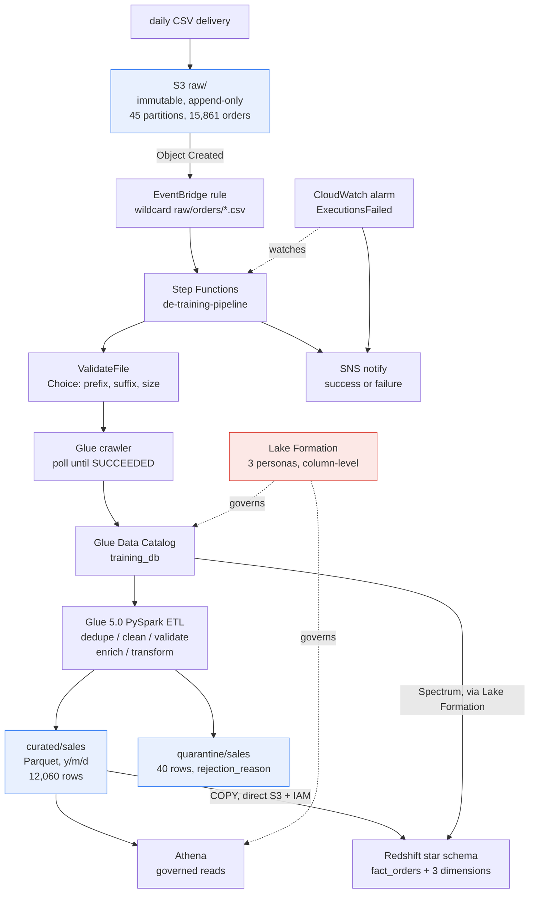
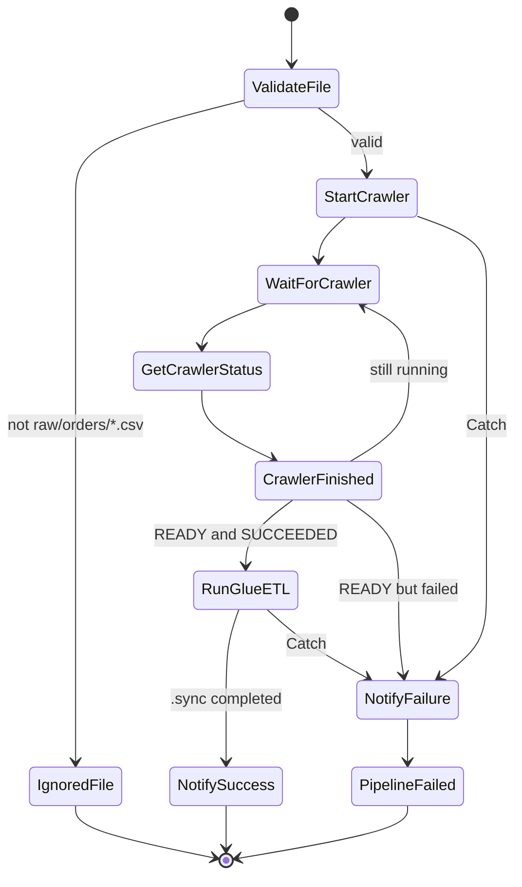
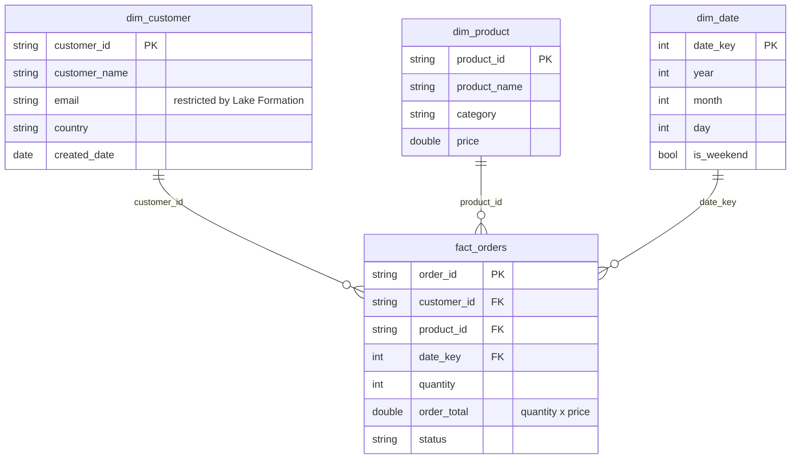

# Retail Data Platform - Architecture

An online retailer receives customer, product and order feeds daily. This is the
platform that lands, catalogs, cleans, validates, governs and serves them.

## What is here

|                               |                                                                                              |
| ----------------------------- | -------------------------------------------------------------------------------------------- |
| `retail-data-platform.drawio` | editable source. Two tabs: **Architecture**, **Terraform Layers**                            |
| `architecture-diagram.png`    | export of the Architecture tab, embedded in the README and required by the brief (section 8) |
| Mermaid blocks below          | the Terraform layer split and the star schema, rendered inline by GitHub                     |

**The star schema has no draw.io tab.** It had one, and it would not open -
draw.io failed with `d.setId is not a function` on that tab alone, while the
other two loaded normally. Two rebuild attempts did not fix it, so the tab was
removed rather than committed broken: a diagram that errors when a reviewer
clicks it is worse than one that lives in Mermaid. The Mermaid `erDiagram`
below carries the same content and renders on GitHub with no tooling. This is
recorded in `docs/troubleshooting.md` as unresolved.

**Re-exporting.** PNG export in draw.io is **per-tab** - it renders whichever
tab you are viewing, and there is no "all pages" option (only PDF has that).
Select the Architecture tab, then _File -> Export as -> PNG_, Zoom 200%,
Border 10, transparent off, saving over `architecture-diagram.png`.

**Editing.** Open the `.drawio` at [app.diagrams.net](https://app.diagrams.net),
the desktop app, or the _Draw.io Integration_ VS Code extension. The format is
XML, so a change is a readable diff rather than an opaque binary blob.

---

## Target platform


The Mermaid below is the current source of truth for what actually runs. It is
text, so it cannot drift the way an export can - the same reasoning as D21.

Out of scope, and labelled "Optional Advanced Exercise" by the brief itself:
Apache Iceberg, CDC/DMS, cross-account Lake Formation. Streaming is deferred -
0% of the rubric, and the only component that would run continuously.

---

## What runs, end to end

Every box below exists and is evidenced in `docs/evidence/`.



**Two access paths to the same bytes**, which is the Phase 7 lesson:

|          | route                           | Lake Formation | result                     |
| -------- | ------------------------------- | -------------- | -------------------------- |
| COPY     | Redshift -> S3                  | not consulted  | worked first time          |
| Spectrum | Redshift -> Catalog -> LF -> S3 | governs        | refused twice, then worked |

Spectrum needed _both_ an LF grant and the IAM action
`lakeformation:GetDataAccess`. Neither implies the other, and they fail at
different stages with different messages.

---

## Orchestration (Phase 8)



`Retry` is configured on `StartCrawler` and `RunGlueETL` for **transient Glue
errors only** - never `States.ALL`. A deterministic failure is caught and
reported immediately; retrying it would bill three runs to fail three times.
Both behaviours were demonstrated:

| execution    | error                          | attempts | outcome                                   |
| ------------ | ------------------------------ | -------: | ----------------------------------------- |
| bad database | `States.TaskFailed`            |        1 | Catch -> NotifyFailure -> ExecutionFailed |
| crawler busy | `Glue.CrawlerRunningException` |        3 | retried twice, recovered                  |

There is deliberately **no `Parallel` state**: every arrow above is a real
dependency, so there is no independent branch to run concurrently. See
`docs/capstone.md` §7 for where one would earn its place.

---

## Terraform layers

Split by lifecycle, not by service - this is what makes a routine
`terraform destroy` safe to run every session.

```mermaid
flowchart LR
    SB["<b>State bucket</b><br/><i>created by the CLI, not Terraform</i>"]

    subgraph P["persistent/ - NEVER destroyed - ~$1/month"]
        direction TB
        P1["KMS CMK + alias + policy"]
        P2["S3 lake bucket<br/><i>versioned, SSE-KMS, TLS-only</i>"]
        P3["IAM: Glue + Redshift roles"]
        P4["IAM: 3 Lake Formation personas"]
        P5["Budgets: $5 daily, $50 monthly"]
        P6["Lake Formation account config<br/><i>settings + registered location</i>"]
        P7["S3 EventBridge notification<br/><i>what makes Phase 8 event-driven</i>"]
        P8["S3 lifecycle rules<br/><i>derived prefixes only - raw/ never expires</i>"]
    end

    subgraph T["training/ - destroyed every session - $0 idle"]
        direction TB
        T1["Glue Catalog database<br/><i>training_db</i>"]
        T2["Athena workgroup<br/><i>1 GiB scan ceiling</i>"]
        T3["CloudWatch log group<br/><i>+ ExecutionsFailed alarm</i>"]
        T4["Glue crawler + PySpark ETL job"]
        T5["Glue Data Quality rulesets"]
        T6["Lake Formation grants + LF-Tag<br/><i>rebuilt every session - D24</i>"]
        T7["EventBridge rule + Step Functions<br/><i>SNS topic</i>"]
        T8["Redshift Serverless<br/><i>namespace + workgroup</i>"]
    end

    SB -.->|holds state| P
    SB -.->|holds state| T
    P -->|terraform_remote_state<br/>reads outputs| T
```



The training layer never creates buckets, keys or roles - it only reads them
from the persistent layer's outputs. That is precisely why destroying it is a
routine operation rather than a risky one.

---

## Star schema (Phase 7)



**Distribution and sort.** `fact_orders` takes `DISTKEY(customer_id)` and
`SORTKEY(date_key)`; `dim_customer` shares the same distribution key so the most
common join is local rather than a broadcast. `dim_product` and `dim_date` are
small enough for `DISTSTYLE ALL`, replicated to every node.

The query this shape exists to answer:

```sql
SELECT c.country, SUM(o.order_total)
FROM fact_orders o
JOIN dim_customer c ON o.customer_id = c.customer_id
GROUP BY c.country;
```

No join is needed to reach `country` - it is denormalised into the dimension,
which is exactly how a warehouse model differs from the source model it came
from.
